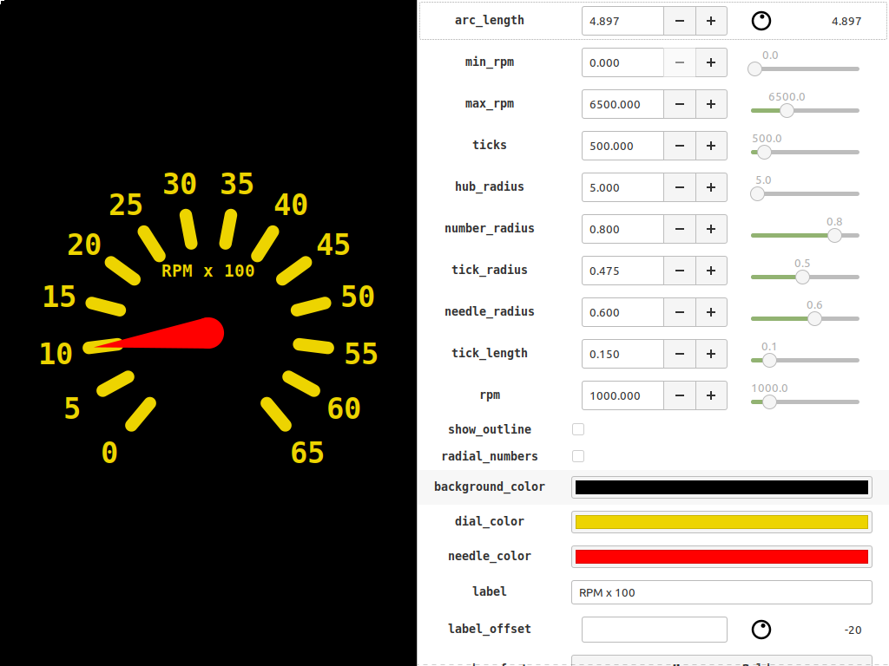

# Readme

*Cairo Sandbox* is an interactive sandbox for the cairo vector
graphics library, and a framework for *procedural graphics*.

Cairo is a wonderful library, useful in a variety of contexts,
and which yields crisp results.

*Cairo Sandbox* is targeted at anyone who wants to do custom drawing
with cairo -- whether you're trying to develp a custom GTK Widget,
dynamic visualizations, embedded display, or parametric graphics.

The goal is get you up-and-runing and get out of the way. At the end,
you should have a script which you can port to your target codebase,
or use directly in your application.

## Sandbox Scripts

*Scripts are stateless! State is not preserved between frames!*.

An image is a python script, which is *run to completion* to produce
each frame, similar to the way "shader programs" work in OpenGL. Your
script may define "parameters", which are external values.

Each time a parameter changes, your script is re-run, and the output
is re-rendered. Alternatively, you can create generate static images
via the offline renderer.

As an optimization, cairo_sandbox dynamically compiles your script to
bytecode at load time, and executes the compiled bytecode for each
frame, rather than executing directly from source. I suspect that, in
practice, the rasterization overhead is likely to be much higher than
the interpreter overhead.

## What it is

It consists of the following components:
- `script.py`         -- library for loading and running sandbox scripts.
- `params`            -- library for defining and using parameters in scripts.
- `helpers.py`        -- a higher-level wrapper around cairo, the use of which is optional
- `cairo_sandbox.py`  -- an interactive rendering environment for script development.
- `wayland_runner.py` -- a stand-alone fullscreen renderer for wayland, with no GTK dependency.
- `offline.py`        -- a stand-alone renderer for static images

## Features

- Instantly launch into a cairo context ready for drawing.
- Automatic reload when your script changes.
- Create live-editable parameters for easy tinkering.
- Decode parameters from `stdin`.
- Stand-alone wayland runner, for embedded applications
- Offline renderer, for static content.

### Debug feedback

- Current point and un-rasterized cairo path are shown.
- Exceptions and stack traces are displayed in real-time.
- `debug_trace` and `debug_fill` for easy path debugging.

### `helpers.py`

- `save`, a context manager which guarantees to call `restore`
- `box`,  a context manager for layout
- basic 2D geometry

# Usage

## Script Development

`./cairo_sandbox <script>`

## Kiosk Mode

You need a data source which can output JSON to `stdout`. It should
write a map on each line, with a key for each parameter defined by the
script. e.g:

`my_json_source | ./wayland_runner.py <script>`

You can also define parameters via the environment. Values from
`stdin` take priority over the values defined in the environment.

See the scripts in the examples directory.

# API

## Cairo

This is exposed to scripts as the `cairo` and  `cr` globals.

- `cairo` The pycairo library.
- `cr`    The current cairo context, ready for drawing

See https://pycairo.readthedocs.io/en/latest/getting_started.html for
more.

## Pango

Used for text rendering, but not directly exposed to scripts.

## Params

An interface for defining and using parameters. This serves two purposes:
- easy tweaking of values as you write your script
- allowing for easy customization / animation / dynamism in your
  application

## `helpers` companion library

It provides some higher-level abstractions and missing features that
ease writing scripts, especially in the beginning.
- `Point`
- `Rect`
- `Box`
- `Save`

# Script Modes

*Scripts are stateless! State is not preserved between frames!*.

You script runs at least twice, in two modes.

Your script should query the `__name__` global. These modes are:

- `'init'`
- `'render'`

## Init Mode

Init mode is run after your script is loaded or re-loaded. This is
when your script should define parameters.

Init Mode Globals:

- `params`, a `helpers.ParameterGroup` instance.

In addition, each of the parameter classes is available under a short
ailias.

- `Numeric`
- `Color`
- `Text`
- `Font`
- `Table`
- `Point`
- `Angle`
- `Infinite`
- `Toggle`
- `Choice`
- `Image`
- `Script`
- `Custom`

## Render Mode

Render mode is run to draw each frame.

The entire canvas is redrawn completely for each frame, and your
script is allowed to run to completion.

You should take care not to make any blocking calls or heavy
computation in this mode.

*State is not preserved between frames! cairo_sandbox scripts are
stateless!*

Render Mode Globals:
- `cr`: the cairo context object
- `cairo`: the pycairo library
- `helpers`: the companion helper object, which extends the cr object
- `math`: the math standard library, which includes useful items like `sin` and `pi`.
  with additional methods.
- `window`: a `helpers.Rect` object with the current window geometry
- `scale_mm`: a tuple of (x, y) indicating the scale for calculating physical distances

# Installation

Not necessary, not possible at the moment.

## Dependencies

- gobject introspection libraries for `Gtk`, `pycairo`.
- Automatic reloading requires `watchdog`.
